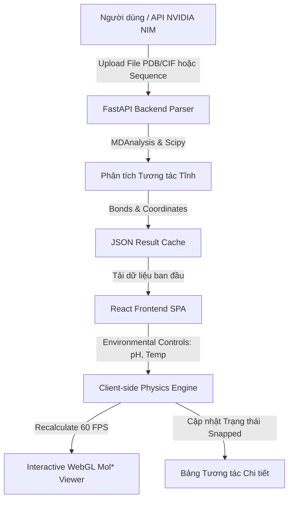

# ProFold lab — Protein Interaction Analysis & 3D Visualization

ProFold lab là một nền tảng tính toán sinh học cao cấp, tích hợp pipeline phân tích động học phân tử, dự đoán cấu trúc 3D (qua NVIDIA NIM OpenFold 3) và mô phỏng tương tác vật lý thời gian thực (Real-time Physics Engine) ngay trên trình duyệt WebGL.

Tài liệu này giải thích chi tiết toàn bộ **cơ chế vật lý**, **công thức toán học** và **pipeline xử lý** của hệ thống phục vụ cho mục đích nghiên cứu và viết báo cáo khoa học.

---

## 1. Pipeline Xử lý Tổng quan (System Pipeline)

Hệ thống hoạt động theo pipeline khép kín từ khâu tiếp nhận đầu vào đến khi biểu diễn trực quan:



### Chi tiết các bước trong Pipeline:
1. **Input**: Nhận file cấu trúc 3D (`.pdb`, `.cif`) được upload từ client hoặc gọi qua NVIDIA NIM API để sinh cấu trúc từ chuỗi Acid Amin.
2. **Static Backend Analysis (Python)**:
   - Sử dụng thư viện **MDAnalysis** để phân tích tọa độ nguyên tử.
   - Sử dụng thuật toán tìm kiếm không gian KDTree để lọc ra các cặp nguyên tử thỏa mãn khoảng cách của liên kết tĩnh (Salt bridges, H-bonds, Disulfides, Pi-stacking, Hydrophobic).
   - Xuất dữ liệu dưới dạng JSON cached.
3. **Dynamic Client Physics (TypeScript)**:
   - Khi tải dữ liệu lên frontend, hệ thống áp dụng bộ sliders **pH** và **Nhiệt độ (T)**.
   - Engine vật lý phía Client (`physicsEngine.ts`) tính toán lại trạng thái tích điện, hằng số điện môi màn chắn, lực cơ học (pN), độ dao động nhiệt RMSF và mạng lưới allosteric Dijkstra ở tốc độ 60 FPS.
4. **WebGL Rendering (Mol*)**:
   - Các liên kết bị đứt (Snapped) sẽ tự động ẩn khỏi cấu trúc 3D trên WebGL.
   - Ribbon protein tự động đổi màu theo độ cứng/mềm nhiệt độ (RMSF heatmap) hoặc làm nổi bật con đường truyền lực cơ học (Allosteric path) bằng màu neon hồng nổi bật.

---

## 2. Cơ chế Khoa học & Công thức Vật lý

### 2.1. Cầu muối (Salt Bridges - Electrostatics)

Liên kết tĩnh điện hình thành giữa nhóm tích điện dương (Cationic) của Acid Amin kiềm (`LYS:NZ`, `ARG:NH1/NH2`, `HIS:ND1/NE2`) và nhóm tích điện âm (Anionic) của Acid Amin axit (`ASP:OD1/OD2`, `GLU:OE1/OE2`).

#### A. Màn chắn Điện môi Mehler-Solmajer
Hằng số điện môi $\varepsilon(r)$ biến thiên theo khoảng cách $r$ để mô phỏng hiệu ứng màn chắn dung môi (solvent screening):
$$\varepsilon(r) = 1.0 + \frac{77.0}{1.0 + e^{-0.357(r - 5.5)}}$$

#### B. Năng lượng Coulomb & Lực tĩnh điện (pN)
Năng lượng cầu muối $E$ (kJ/mol):
$$E(r) = \frac{k_C \cdot q_1 \cdot q_2}{\varepsilon(r) \cdot r}$$
Trong đó $k_C = 1389.354 \text{ kJ}\cdot\text{\AA}/(\text{mol}\cdot e^2)$, $q_1, q_2$ là điện tích thực tế của hai acid amin.

Lực cơ học tĩnh điện $F$ (pN) truyền qua liên kết là đạo hàm âm của năng lượng theo khoảng cách ($F = -\frac{dE}{dr}$):
$$F(r) = \text{Scale}_{pN} \cdot \left| -k_C \cdot q_1 \cdot q_2 \cdot \left( \frac{1}{\varepsilon(r) \cdot r^2} + \frac{\varepsilon'(r)}{\varepsilon(r)^2 \cdot r} \right) \right|$$
Trong đó hệ số đổi đơn vị lực là $16.60539\text{ pN}$ cho mỗi $\text{kJ}/(\text{mol}\cdot\text{\AA})$, và đạo hàm $\varepsilon'(r)$ được tính bằng:
$$\varepsilon'(r) = \frac{77.0 \cdot 0.357 \cdot e^{-0.357(r - 5.5)}}{\left(1.0 + e^{-0.357(r - 5.5)}\right)^2}$$

---

### 2.2. Sự dịch chuyển $pK_a$ do tương tác Coulomb môi trường

Độ pH ảnh hưởng trực tiếp đến trạng thái proton hóa (protonation state) của acid amin. Dưới ảnh hưởng của các điện tích lân cận trong cấu trúc 3D, hằng số phân ly acid phối cảnh ($pK_a$) bị dịch chuyển:
$$pK_{a,\text{shifted}} = pK_{a,\text{ideal}} + \Delta pK_a$$
$$\Delta pK_a = \sum_{j} \frac{k_C \cdot q_{\text{partner}}}{2.303 \cdot R \cdot T \cdot \varepsilon(r) \cdot r_j}$$
Trong đó $R = 8.314 \times 10^{-3} \text{ kJ}/(\text{mol}\cdot\text{K})$ và $T$ là nhiệt độ (K).

Sau khi xác định $pK_{a,\text{shifted}}$, điện tích thực tế của từng nhóm phân ly được tính bằng phương trình Henderson-Hasselbalch:
*   **Acidic (ASP, GLU)**:
    $$q = \frac{-1.0}{1.0 + 10^{pK_{a,\text{shifted}} - \text{pH}}}$$
*   **Basic (LYS, ARG, HIS)**:
    $$q = \frac{+1.0}{1.0 + 10^{\text{pH} - pK_{a,\text{shifted}}}}$$

> [!IMPORTANT]
> **Cơ chế đứt liên kết (Snapping)**
> Một cầu muối được coi là đã đứt (Snapped) và biến mất khỏi cấu trúc nếu năng lượng liên kết bị yếu đi vượt ngưỡng bảo toàn:
> $$E(r) > -2.0 \text{ kJ/mol}$$
> Điều này xảy ra khi pH cực đoan làm trung hòa điện tích của một trong hai đối tác liên kết.

---

### 2.3. Liên kết Hydro (Hydrogen Bonds)
Được phát hiện theo tiêu chí hình học nghiêm ngặt:
*   Khoảng cách giữa Nguyên tử cho (Donor) và Nhận (Acceptor) $d(D, A) \le 3.5\text{ \AA}$.
*   Góc liên kết $\angle(D-H-A) \ge 120^\circ$.
*   **Cơ chế đứt do pH**: Ở pH cực đoan ($\text{pH} < 2$ hoặc $\text{pH} > 12$), các nhóm carboxyl hoặc amin bị proton hóa/deprotonated cưỡng bức, làm giảm hệ số năng lượng liên kết xuống $30\%$, kích hoạt trạng thái đứt khi $E > -1.5 \text{ kJ/mol}$.

---

### 2.4. Liên kết Disulfide bền vững (Disulfide Bonds)
Liên kết cộng hóa trị giữa hai nguyên tử Lưu huỳnh (`SG`) của acid amin Cysteine (`CYS`). Năng lượng biến dạng liên kết được tính bằng thế năng kéo dãn điều hòa (harmonic stretch) cộng thế năng xoắn góc dihedral:
$$E_{\text{disulfide}} = K_b(r - r_0)^2 + K_\phi(1.0 + \cos(3\phi - \phi_0))$$
*   Khoảng cách cân bằng $r_0 = 2.05\text{ \AA}$, độ cứng liên kết $K_b = 90000\text{ kJ}/(\text{mol}\cdot\text{\AA}^2)$.
*   Lực phục hồi cơ học (Restoring Force) đạt tới hàng nghìn pN nếu liên kết bị kéo dãn khỏi trạng thái cân bằng:
    $$F_{\text{restore}} = 2 \cdot K_b \cdot |r - r_0| \cdot 16.60539\text{ pN}$$

---

### 2.5. Pi-Stacking & Tương tác Kỵ nước (Hydrophobic)
*   **Pi-Stacking**: Đo khoảng cách giữa tâm vòng thơm của `PHE`, `TYR`, `TRP`. Phân loại thành **Face-to-Face** (độ lệch góc $< 30^\circ$) và **T-shaped** (độ lệch góc $> 60^\circ$).
*   **Hydrophobic**: Sử dụng thế năng Lennard-Jones để ước lượng năng lượng tiếp xúc kỵ nước giữa các mạch bên không phân cực ở khoảng cách ngắn ($d \le 5.0\text{ \AA}$).

---

## 3. Độ dao động nhiệt RMSF (Thermal Fluctuation)

Để hiển thị trực quan tác động của Nhiệt độ lên độ linh động của protein, hệ thống xây dựng mô hình mạng lưới đàn hồi cục bộ (Elastic Network Model):
1. **Độ cứng cục bộ $K_i$** của residue $i$ là tổng năng lượng các tương tác hoạt động liên kết với nó:
   $$K_i = \sum_{j} \frac{|E_{ij}|}{d_{ij}^2}$$
2. **Độ biến dạng nhiệt (RMSF)** được tính theo công thức chuẩn hóa nhiệt động lực học:
   $$\text{RMSF}_i = 0.2 + \frac{0.8 \cdot \sqrt{\frac{T}{298.15}}}{1.0 + K_i} \text{ (\AA)}$$

#### Phân màu Nhiệt độ (Thermal Heatmap):
*   $\text{RMSF} \le 0.4\text{ \AA}$: **Xanh lam (Blue)** - Cực kỳ cứng cáp (lõi hydrophobic, liên kết disulfide).
*   $0.4 < \text{RMSF} \le 0.6\text{ \AA}$: **Vàng hổ phách (Amber)** - Độ linh động trung bình.
*   $\text{RMSF} > 0.6\text{ \AA}$: **Đỏ (Red)** - Rất linh động (đầu N/C termini, vòng loop không liên kết).

---

## 4. Mạng lưới Stress truyền lực Allosteric (Dijkstra Mechanical Network)

Protein truyền tín hiệu cơ học qua các chuỗi liên kết hóa học. ProFold lab tìm kiếm con đường truyền ứng suất cơ học tối ưu giữa 2 acid amin bất kỳ bằng thuật toán đồ thị:
*   **Trọng số cạnh (Sức cản cơ học)**: Trọng số giữa hai acid amin tỷ lệ nghịch với năng lượng tương tác tĩnh của liên kết:
    $$W_{ij} = \frac{1.0}{|E_{ij}| + 0.1}$$
    *Liên kết càng mạnh (năng lượng âm lớn) thì sức cản cơ học $W_{ij}$ càng nhỏ.*
*   **Thuật toán**: Áp dụng **Dijkstra** để tìm đường đi ngắn nhất (ít kháng cự cơ học nhất) từ nguồn tới đích. Đường đi này mô phỏng lại kênh truyền ứng suất cơ học dọc protein khi bị kéo giãn hoặc đột biến.

---

## 5. Hướng dẫn chạy và Triển khai (Deployment)

### Yêu cầu hệ thống:
*   Node.js v18+ và Python v3.10+
*   Hoặc Docker & Docker Compose

### Cách 1: Chạy trực tiếp trên máy local

1. **Khởi chạy Backend API**:
   ```bash
   cd backend
   python3 -m venv venv
   source venv/bin/activate
   pip install -r requirements.txt
   python3 app.py
   ```
   API chạy tại: `http://localhost:8000`

2. **Khởi chạy Frontend Client**:
   ```bash
   cd frontend
   npm install
   npm run dev
   ```
   Ứng dụng chạy tại: `http://localhost:5174` (hoặc `5173`)

### Cách 2: Triển khai nhanh bằng Docker Compose
```bash
docker-compose up --build
```
Dịch vụ tự động cấu hình và mở kết nối ở cổng mặc định.
